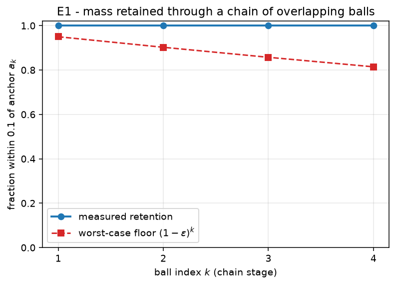
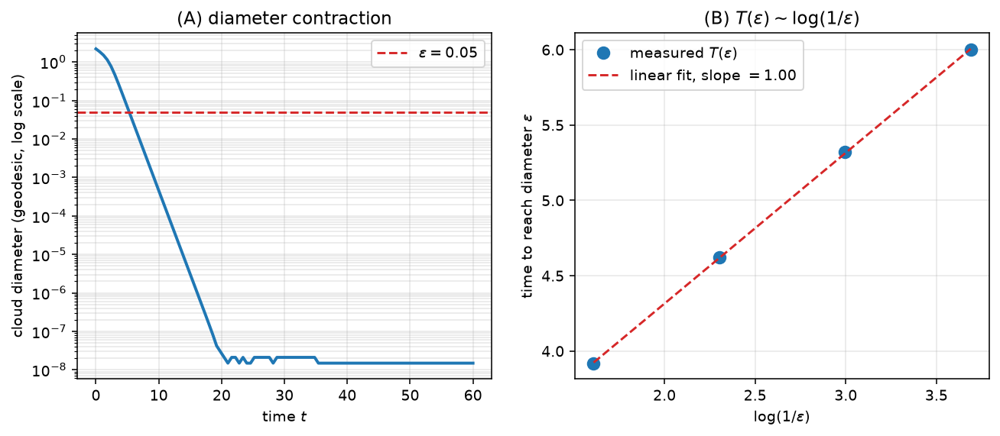
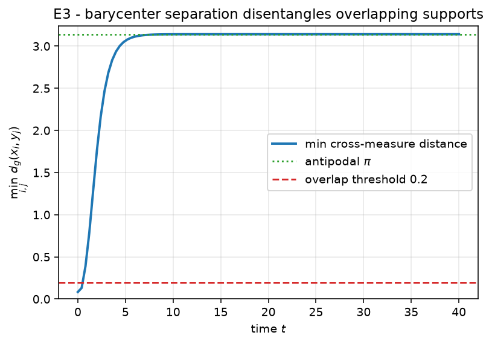
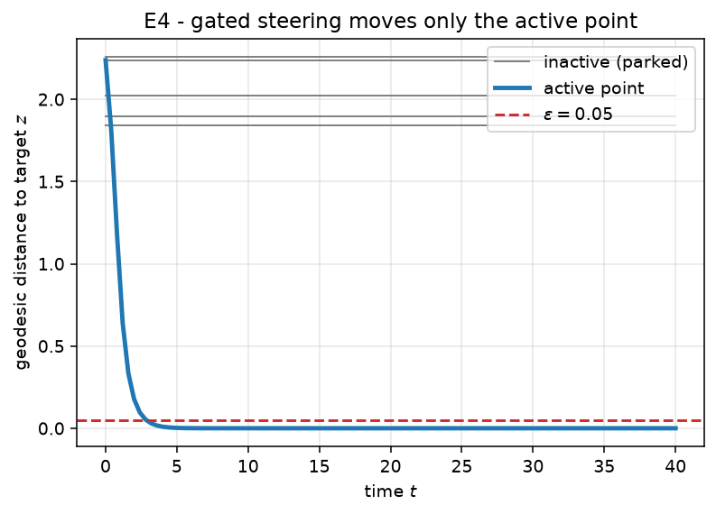
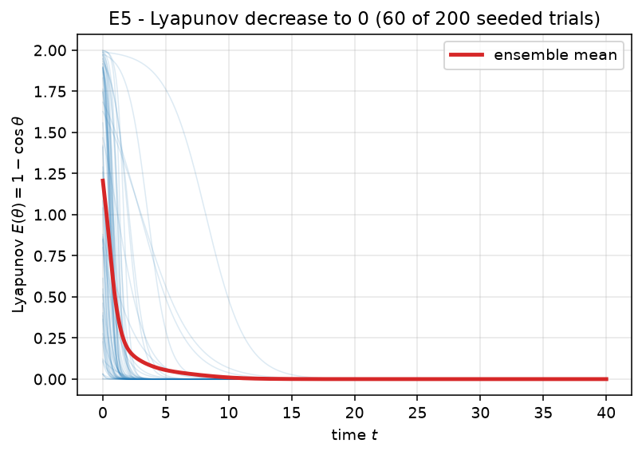
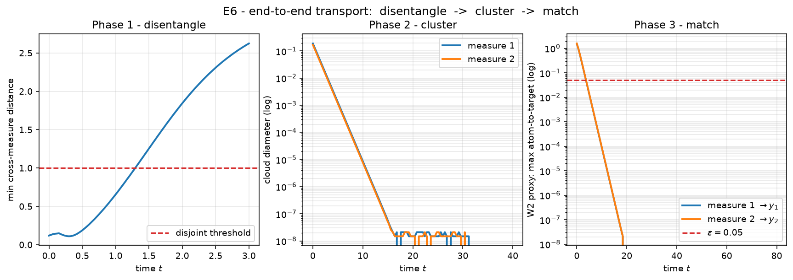
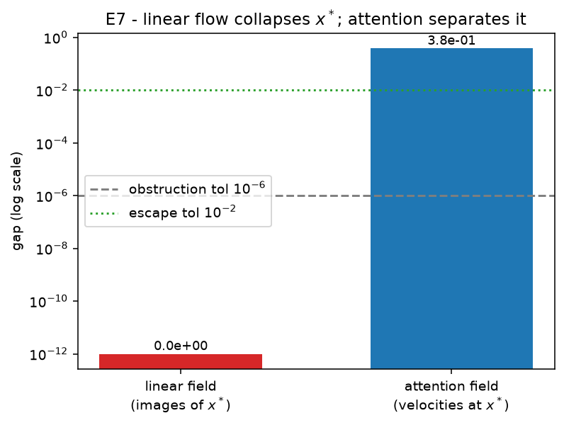

## Overview

This report documents 7 seeded numerical experiments validating
Geshkovski, Rigollet, Ruiz-Balet, *Measure-to-measure interpolation using Transformers*, arXiv:2411.04551v3. All runs are deterministic (`SEED = 0`) and integrate the
characteristic flow of the continuity equation (1.3),
$\dot x = P_x^\perp v(t,x)$ with $P_x^\perp = I - x x^\top$, on the unit sphere.

The experiments are run **alongside** the proofs, not batched at the end: an optional exploratory
probe shapes a hypothesis before a proof, and a seeded validation always follows it. The full
workflow is documented in `WORKFLOW.md`. Each experiment below is presented as **hypothesis**, **what
is tested** (the cross-linked claim and pass criterion), **method** (the integrator code and a brief
explanation), **results** (a figure and the measured metrics), and **analysis** (the verdict with its
provenance).

**Campaign result: 7 / 7 pass.**

| Experiment | Claim | Verdict |
| --- | --- | --- |
| E1_mass_transport | `claim:exp-e1-mass-transport` | **PASS** |
| E2_clustering | `claim:exp-e2-clustering` | **PASS** |
| E3_disentangle | `claim:exp-e3-disentangle` | **PASS** |
| E4_matching | `claim:exp-e4-matching` | **PASS** |
| E5_lyapunov | `claim:exp-e5-lyapunov` | **PASS** |
| E6_end_to_end | `claim:exp-e6-end-to-end` | **PASS** |
| E7_linear_impossible | `claim:exp-e7-linear-impossible` | **PASS** |


## E1_mass_transport

### Hypothesis

The ReLU-gated drift of Lemma B.2 concentrates a single-hemisphere measure at the ball anchor, and chaining K overlapping balls (Lemma B.1) retains at least (1-eps)^K of the mass at the final anchor a_K.

### What is tested

Claim `claim:exp-e1-mass-transport`. It validates:

| claim | paper node | status |
| --- | --- | --- |
| `leaf-gate-ode` | eq. B.4-B.5, p.32 | math.machine-checked |
| `leaf-ball-chain-induction` | Lem B.1 proof, p.33 | math.machine-checked |
| `lem-b-2` | Lem B.2, p.31 | math.open |
| `lem-b-1` | Lem B.1, p.31 | math.open |

**Pass criterion.** single ball: fraction in inner cap >= 1-eps=0.95; chain of K=4: fraction >= (1-eps)^K=0.8145

### Method

Each stage integrates x' = P_x^perp (cos R - <z,x>)_+ omega with R = pi/2 and omega = -z the deepest point of the active hemisphere, then measures the fraction of atoms landing within geodesic distance 0.1 of that stage's anchor. The figure overlays the measured per-stage retention on the (1-eps)^k floor: measured retention stays near 1 while the worst-case floor decays, so the chain beats its guarantee at every stage.

Full source: [`experiments/E1_mass_transport/run.py`](https://github.com/aquemy/measure-to-measure-transformers/blob/main/experiments/E1_mass_transport/run.py).

```python
def gated_field(z: np.ndarray, R: float, omega: np.ndarray):
    cosR = np.cos(R)

    def field(t, x):
        gate = relu(cosR - x @ z)  # shape (n,)
        return gate[:, None] * omega[None, :]  # shape (n, d)

    return field

def single_ball(rng, d=3, t_span=30.0, n_steps=3000, n=4000):
    R = np.pi / 2.0
    z = normalize(rng.normal(size=d))
    omega = -z  # deepest point of the active region
    # seed in the active region (cap around omega), away from the boundary
    x0 = sample_cap(rng, omega, 0.45 * np.pi, n)
    xT = integrate(gated_field(z, R, omega), x0, t_span, n_steps)
    frac = float(np.mean(geodesic_distance(xT, omega[None, :]) <= 0.1))
    return frac, omega

def chain(rng, K=4, d=3, t_span=30.0, n_steps=3000, n=4000):
    R = np.pi / 2.0
    base = normalize(rng.normal(size=d))
    tangent = normalize(rng.normal(size=d))
    tangent = normalize(tangent - (tangent @ base) * base)
    step = 0.3  # geodesic spacing < pi/2, so stages overlap
    anchors = [normalize(np.cos(k * step) * base + np.sin(k * step) * tangent) for k in range(K + 1)]

    x = sample_cap(rng, anchors[0], 0.12, n)  # start tightly around a_0
    fracs = []  # retention measured at each waypoint a_1..a_K
    for k in range(K):
        omega = anchors[k + 1]
        z = -omega
        x = integrate(gated_field(z, R, omega), x, t_span, n_steps)
        fracs.append(float(np.mean(geodesic_distance(x, omega[None, :]) <= 0.1)))
    return fracs, K

def main() -> int:
    rng = np.random.default_rng(SEED)
    eps = 0.05

    frac_single, _ = single_ball(rng)
    fracs, K = chain(rng)
    frac_chain = fracs[-1]

    pass_single = frac_single >= 1.0 - eps
    pass_chain = frac_chain >= (1.0 - eps) ** K
    passed = pass_single and pass_chain
    # ... figure generation and Result(...) omitted; see full source.
```

### Results

{width=100%}

| metric | value |
| --- | --- |
| `K` | 4 |
| `eps` | 0.05 |
| `fraction_chain` | 1 |
| `fraction_single_ball` | 1 |
| `fractions_per_stage` | [1, 1, 1, 1] |

### Analysis

Verdict: **PASS**. The measured metrics meet the pass criterion above. Provenance: seed 0, git `2053bff2f3`, 2026-06-30T15:04:27 UTC, numpy 2.5.0, python 3.14.6.


## E2_clustering

### Hypothesis

Self-attention with B = beta I on a measure supported in an open hemisphere contracts its geodesic convex hull to a single point (Proposition 2.1); the diameter decays exponentially, so the time to reach diameter eps grows like O(log(1/eps)).

### What is tested

Claim `claim:exp-e2-clustering`. It validates:

| claim | paper node | status |
| --- | --- | --- |
| `prop-2-1` | Prop 2.1, p.11 | math.open |

**Pass criterion.** diameter contracts from 2.207 to < eps=0.05; time-to-eps grows ~ log(1/eps) (positive slope)

### Method

We integrate the characteristic flow x' = P_x^perp A_B[mu](x) and record the cloud diameter over time (panel A, log scale -- a straight line is exponential decay). Panel B plots the first time the diameter drops below eps against log(1/eps) for a geometric sweep of eps; a positive-slope linear fit confirms the O(log 1/eps) rate.

Full source: [`experiments/E2_clustering/run.py`](https://github.com/aquemy/measure-to-measure-transformers/blob/main/experiments/E2_clustering/run.py).

```python
def time_to_diam(field, X0, target_diam: float, t_max: float, n_steps: int) -> float:
    dt = t_max / n_steps
    X = normalize(X0.copy())
    from common import tangential_projector_apply

    def rhs(t, x):
        return tangential_projector_apply(x, field(t, x))

    t = 0.0
    for _ in range(n_steps):
        # RK4 step
        k1 = rhs(t, X)
        k2 = rhs(t, normalize(X + 0.5 * dt * k1))
        k3 = rhs(t, normalize(X + 0.5 * dt * k2))
        k4 = rhs(t, normalize(X + dt * k3))
        X = normalize(X + (dt / 6.0) * (k1 + 2 * k2 + 2 * k3 + k4))
        t += dt
        if max_pairwise_geodesic(X) < target_diam:
            return t
    return t_max

def main() -> int:
    rng = np.random.default_rng(SEED)
    d, n = 4, 60
    beta = 4.0
    p = normalize(rng.normal(size=d))
    X0 = sample_cap(rng, p, 0.4 * np.pi, n)  # support in an open hemisphere

    field = attention_ambient(beta)

    init_diam = max_pairwise_geodesic(X0)
    times_d, states = integrate_trace(field, X0, t_span=60.0, n_steps=4000)
    diams = np.array([max_pairwise_geodesic(s) for s in states])
    final_diam = float(diams[-1])

    # rate check: time to reach successively smaller diameters
    eps_list = [0.2, 0.1, 0.05, 0.025]
    times = [time_to_diam(field, X0, e, t_max=120.0, n_steps=6000) for e in eps_list]
    logs = np.log(1.0 / np.array(eps_list))
    # linear fit T ~ a*log(1/eps) + b
    A = np.vstack([logs, np.ones_like(logs)]).T
    coef, res, *_ = np.linalg.lstsq(A, np.array(times), rcond=None)
    slope = float(coef[0])

    eps = 0.05
    pass_contract = final_diam < eps and init_diam > 0.5
    pass_rate = slope > 0.0
    passed = pass_contract and pass_rate
    # ... figure generation and Result(...) omitted; see full source.
```

### Results

{width=100%}

| metric | value |
| --- | --- |
| `eps_list` | [0.2, 0.1, 0.05, 0.025] |
| `final_diam` | 1.49e-08 |
| `init_diam` | 2.207 |
| `rate_slope_vs_log` | 1.001 |
| `times` | [3.92, 4.62, 5.32, 6] |

### Analysis

Verdict: **PASS**. The measured metrics meet the pass criterion above. Provenance: seed 0, git `2053bff2f3`, 2026-06-30T15:04:44 UTC, numpy 2.5.0, python 3.14.6.


## E3_disentangle

### Hypothesis

Two measures with overlapping supports but opposite-sign barycenters along alpha are driven to the antipodal clusters +alpha and -alpha by the barycenter field of Proposition 3.1 / Lemma 3.3, so their supports become disjoint.

### What is tested

Claim `claim:exp-e3-disentangle`. It validates:

| claim | paper node | status |
| --- | --- | --- |
| `prop-3-1` | Prop 3.1, p.15 | math.open |
| `lem-3-3` | Lem 3.3, p.16 | math.open |
| `leaf-barycenter-ode` | eq. B.9, p.33 | math.machine-checked |
| `leaf-barycenter-noncolinear` | Prop 3.1 induction, p.16-17 (finding F2) | math.machine-checked |

**Pass criterion.** two measures with overlapping supports (min cross-distance < 0.2) become disjoint (min cross-distance > 2.0) under barycenter-separation

### Method

Each measure evolves under x' = <alpha, E_mu[x]> P_x^perp alpha (its own barycenter sign). We track the minimum cross-measure geodesic distance over time: it starts near 0 (overlap) and rises toward pi (antipodal). The dashed line marks the 0.2 overlap threshold; the dotted line marks the antipodal distance pi.

Full source: [`experiments/E3_disentangle/run.py`](https://github.com/aquemy/measure-to-measure-transformers/blob/main/experiments/E3_disentangle/run.py).

```python
def cross_min_distance(A: np.ndarray, B: np.ndarray) -> float:
    G = np.clip(A @ B.T, -1.0, 1.0)
    return float(np.arccos(G).min())

def evolve_two(C1, C2, alpha, t_span, n_steps, record_every=None):
    if record_every is None:
        record_every = max(1, n_steps // 100)
    dt = t_span / n_steps
    C1 = normalize(C1.copy())
    C2 = normalize(C2.copy())

    def step(C):
        c = float(alpha @ C.mean(axis=0))  # barycenter component <alpha, E_mu[x]>
        def rhs(X):
            return c * tangential_projector_apply(X, np.broadcast_to(alpha, X.shape))
        k1 = rhs(C)
        k2 = rhs(normalize(C + 0.5 * dt * k1))
        k3 = rhs(normalize(C + 0.5 * dt * k2))
        k4 = rhs(normalize(C + dt * k3))
        return normalize(C + (dt / 6.0) * (k1 + 2 * k2 + 2 * k3 + k4))

    times = [0.0]
    cross = [cross_min_distance(C1, C2)]
    t = 0.0
    for stepi in range(n_steps):
        C1, C2 = step(C1), step(C2)
        t += dt
        if (stepi + 1) % record_every == 0:
            times.append(t)
            cross.append(cross_min_distance(C1, C2))
    return C1, C2, np.array(times), np.array(cross)

def main() -> int:
    rng = np.random.default_rng(SEED)
    d, n = 4, 40
    alpha = np.zeros(d); alpha[0] = 1.0  # separation direction e_0

    # two clouds straddling the equator: overlapping supports, opposite-sign barycenters along alpha
    c1 = normalize(np.array([0.3, 1.0, 0.0, 0.0]))
    c2 = normalize(np.array([-0.3, 1.0, 0.0, 0.0]))
    C1 = sample_cap(rng, c1, 0.5, n)
    C2 = sample_cap(rng, c2, 0.5, n)

    init_cross = cross_min_distance(C1, C2)
    C1T, C2T, times, cross = evolve_two(C1, C2, alpha, t_span=40.0, n_steps=3000)
    final_cross = cross_min_distance(C1T, C2T)

    passed = init_cross < 0.2 and final_cross > 2.0  # overlapping -> near antipodal (pi ~ 3.14)
    # ... figure generation and Result(...) omitted; see full source.
```

### Results

{width=100%}

| metric | value |
| --- | --- |
| `final_cross_min_distance` | 3.142 |
| `init_cross_min_distance` | 0.08343 |

### Analysis

Verdict: **PASS**. The measured metrics meet the pass criterion above. Provenance: seed 0, git `2053bff2f3`, 2026-06-30T15:04:45 UTC, numpy 2.5.0, python 3.14.6.


## E4_matching

### Hypothesis

The perceptron gate g(x) = (tau - <a,x>)_+ is identically zero on the parking cap B(a, rho) and positive outside it, so the field x' = g(x) P_x^perp z (Proposition 4.2) drives only the active point to the target z while every parked point stays fixed.

### What is tested

Claim `claim:exp-e4-matching`. It validates:

| claim | paper node | status |
| --- | --- | --- |
| `prop-4-2` | Prop 4.2, p.18 | math.open |
| `prop-4-1` | Prop 4.1, p.18 | math.open |
| `leaf-sep-hyperplane` | Prop 4.2 Step 1, p.20 | math.machine-checked |

**Pass criterion.** inactive points stay fixed (max move < eps=0.05) and the active point reaches the target (geodesic distance < eps=0.05)

### Method

M-1 inactive points are seeded inside the parking cap (gate off) and one active point outside it (gate on). We record each point's geodesic distance to the drift target z over time: the active point's distance falls below eps while the parked points' distances stay flat (they never move). This is the selective-motion core of the gather / corridor / restore matching construction.

Full source: [`experiments/E4_matching/run.py`](https://github.com/aquemy/measure-to-measure-transformers/blob/main/experiments/E4_matching/run.py).

```python
def main() -> int:
    rng = np.random.default_rng(SEED)
    d, M = 3, 6

    # parking direction and gate threshold: inactive cap is {<a,x> >= cos(rho)} i.e. near `a`
    a = np.zeros(d); a[0] = 1.0
    rho = 3 * np.pi / 16  # paper's parking cap radius
    tau = np.cos(rho)  # gate zero on B(a, rho): there <a,x> >= cos(rho) = tau? see below

    # We want the gate OFF on the inactive cap around `a` and ON at the active point.
    # Use gate g(x) = (tau - <a,x>)_+: zero when <a,x> >= tau (inside cap B(a,rho)), positive outside.
    inactive = sample_cap(rng, a, rho * 0.8, M - 1)  # parked points, gate off
    z = normalize(np.array([-0.6, 0.8, 0.0]))  # drift target, outside the cap
    active0 = normalize(np.array([-0.2, -0.9, 0.3]))  # active point, outside the cap

    def field(t, X):
        gate = relu(tau - X @ a)  # 0 on the cap around a, >0 outside
        return gate[:, None] * z[None, :]

    X0 = np.vstack([inactive, active0[None, :]])
    times, states = integrate_trace(field, X0, t_span=40.0, n_steps=4000)
    XT = states[-1]

    inactive_move = float(geodesic_distance(XT[:M - 1], X0[:M - 1]).max())
    active_to_target = float(geodesic_distance(XT[M - 1][None, :], z[None, :])[0])

    eps = 0.05
    passed = inactive_move < eps and active_to_target < eps
    # ... figure generation and Result(...) omitted; see full source.
```

### Results

{width=100%}

| metric | value |
| --- | --- |
| `M` | 6 |
| `active_to_target` | 0 |
| `inactive_max_move` | 0 |

### Analysis

Verdict: **PASS**. The measured metrics meet the pass criterion above. Provenance: seed 0, git `2053bff2f3`, 2026-06-30T15:04:46 UTC, numpy 2.5.0, python 3.14.6.


## E5_lyapunov

### Hypothesis

For the d=2 flow theta' = -alpha sin(theta) (Example 6.1), the Lyapunov function E(theta) = 1 - cos(theta) satisfies E'(t) = -alpha sin^2(theta) <= 0, so E decreases monotonically and theta(t) -> 0 (the cluster direction) from any start in (-pi, pi).

### What is tested

Claim `claim:exp-e5-lyapunov`. It validates:

| claim | paper node | status |
| --- | --- | --- |
| `leaf-lyapunov` | Example 6.1, p.29 | math.machine-checked |

**Pass criterion.** E=1-cos(theta) nonincreasing (max step increase <= 1e-09) and theta(T) -> 0 (|theta(T)| <= 0.001) over 200 seeded trials

### Method

We integrate the angle ODE from 200 seeded (alpha, theta0) pairs and form E = 1 - cos(theta) along each trajectory. The figure overlays a subsample of E(t) curves (all monotonically decreasing) with the ensemble mean. The verdict checks that no step increases E beyond RK4 round-off and that every trajectory converges to 0.

Full source: [`experiments/E5_lyapunov/run.py`](https://github.com/aquemy/measure-to-measure-transformers/blob/main/experiments/E5_lyapunov/run.py).

```python
def simulate(alpha: float, theta0: float, t_span: float, n_steps: int) -> np.ndarray:
    dt = t_span / n_steps
    thetas = np.empty(n_steps + 1)
    thetas[0] = theta0
    th = theta0
    f = lambda t: -alpha * np.sin(t)
    for k in range(n_steps):
        k1 = f(th)
        k2 = f(th + 0.5 * dt * k1)
        k3 = f(th + 0.5 * dt * k2)
        k4 = f(th + dt * k3)
        th = th + (dt / 6.0) * (k1 + 2 * k2 + 2 * k3 + k4)
        thetas[k + 1] = th
    return thetas

def main() -> int:
    rng = np.random.default_rng(SEED)
    n_trials = 200
    t_span, n_steps = 40.0, 4000

    max_increase = 0.0  # largest positive jump in E along any trajectory
    worst_final_theta = 0.0  # largest |theta(T)| over trials (should be ~0)

    tgrid = np.linspace(0.0, t_span, n_steps + 1)
    n_plot = 60  # subsample of trajectories to draw (keeps the figure legible)
    E_curves = []

    for i in range(n_trials):
        alpha = float(rng.uniform(0.2, 3.0))
        # avoid the unstable equilibrium theta = pi exactly; the basin of 0 is (-pi, pi)
        theta0 = float(rng.uniform(-np.pi + 0.05, np.pi - 0.05))
        thetas = simulate(alpha, theta0, t_span, n_steps)
        E = 1.0 - np.cos(thetas)
        dE = np.diff(E)
        max_increase = max(max_increase, float(dE.max()))
        worst_final_theta = max(worst_final_theta, abs(float(thetas[-1])))
        if i < n_plot:
            E_curves.append(E)

    # tolerances: monotone decrease up to RK4 round-off; convergence to the cluster
    tol_increase = 1e-9
    tol_final = 1e-3
    passed = (max_increase <= tol_increase) and (worst_final_theta <= tol_final)
    # ... figure generation and Result(...) omitted; see full source.
```

### Results

{width=100%}

| metric | value |
| --- | --- |
| `max_E_increase_per_step` | 0 |
| `n_trials` | 200 |
| `worst_final_abs_theta` | 3.67e-04 |

### Analysis

Verdict: **PASS**. The measured metrics meet the pass criterion above. Provenance: seed 0, git `2053bff2f3`, 2026-06-30T15:04:48 UTC, numpy 2.5.0, python 3.14.6.


## E6_end_to_end

### Hypothesis

The composed map Phi_fin = match o cluster o disentangle (Theorems 1.1 / 1.2) sends two measures with overlapping supports to two distinct Dirac targets: disentangle makes the supports disjoint, cluster collapses each to a point, and match steers each point to its target.

### What is tested

Claim `claim:exp-e6-end-to-end`. It validates:

| claim | paper node | status |
| --- | --- | --- |
| `thm-1-1` | Thm 1.1, p.5 | math.open |
| `thm-1-2` | Thm 1.2, p.5 | math.open |

**Pass criterion.** supports disjoint after disentangle (cross-distance > 1.0) and each transported measure is within eps=0.05 of its target (W2 proxy = max atom-to-target distance)

### Method

We run the three phases in sequence and record one scalar per phase over time: the minimum cross-measure distance (phase 1, must exceed 1.0 so matching is single-valued), each measure's diameter (phase 2, contracts to a point), and the W2 proxy max-atom-to-target distance (phase 3, falls below eps). The three-panel figure shows the full pipeline; the verdict checks the phase-1 separation and both final W2 proxies.

Full source: [`experiments/E6_end_to_end/run.py`](https://github.com/aquemy/measure-to-measure-transformers/blob/main/experiments/E6_end_to_end/run.py).

```python
def rk4_cloud(rhs, C, dt, n_steps, record_every=None):
    C = normalize(C.copy())
    states = [C.copy()]
    for stepi in range(n_steps):
        k1 = rhs(C)
        k2 = rhs(normalize(C + 0.5 * dt * k1))
        k3 = rhs(normalize(C + 0.5 * dt * k2))
        k4 = rhs(normalize(C + dt * k3))
        C = normalize(C + (dt / 6.0) * (k1 + 2 * k2 + 2 * k3 + k4))
        if record_every and (stepi + 1) % record_every == 0:
            states.append(C.copy())
    return C, states

def disentangle(C, alpha, t_span=40.0, n_steps=3000, record_every=None):
    dt = t_span / n_steps
    def rhs(X):
        c = float(alpha @ X.mean(axis=0))
        return c * tangential_projector_apply(X, np.broadcast_to(alpha, X.shape))
    return rk4_cloud(rhs, C, dt, n_steps, record_every)

def cluster(C, beta=5.0, t_span=40.0, n_steps=3000, record_every=None):
    field = attention_ambient(beta)
    _, states = integrate_trace(field, C, t_span, n_steps, record_every)
    return states[-1], states

def match(C, target, t_span=80.0, n_steps=6000, record_every=None):
    dt = t_span / n_steps
    def rhs(X):
        # constant tangential drift toward `target`; P_x^perp target vanishes exactly at x = target,
        # so the flow converges to the target and stops there.
        return tangential_projector_apply(X, np.broadcast_to(target, X.shape))
    return rk4_cloud(rhs, C, dt, n_steps, record_every)

def cross_min_distance(A, B):
    return float(np.arccos(np.clip(A @ B.T, -1.0, 1.0)).min())

def main() -> int:
    rng = np.random.default_rng(SEED)
    d, n = 4, 30
    alpha = np.zeros(d); alpha[0] = 1.0

    # two overlapping input clouds
    C1 = sample_cap(rng, normalize(np.array([0.3, 1.0, 0.0, 0.0])), 0.5, n)
    C2 = sample_cap(rng, normalize(np.array([-0.3, 1.0, 0.0, 0.0])), 0.5, n)

    # two distinct Dirac targets
    y1 = normalize(np.array([0.0, 0.0, 1.0, 0.0]))
    y2 = normalize(np.array([0.0, 0.0, 0.0, 1.0]))

    eps = 0.05

    # Phase 1: disentangle (each measure under its own barycenter field), recording trajectories.
    # We disentangle only until the supports are disjoint (t_span=3): the barycenter field also
    # contracts each cloud toward its pole, so running it to convergence would collapse the clouds
    # and leave nothing for the cluster phase. Stopping early keeps the three phases distinct.
    t_dis = 3.0
    C1a, st1a = disentangle(C1, alpha, t_span=t_dis, record_every=30)
    C2a, st1b = disentangle(C2, alpha, t_span=t_dis, record_every=30)
    sep_after_disentangle = cross_min_distance(C1a, C2a)
    sep_curve = np.array([cross_min_distance(a, b) for a, b in zip(st1a, st1b)])

    # Phase 2: cluster each to a point
    C1b, st2a = cluster(C1a, record_every=30)
    C2b, st2b = cluster(C2a, record_every=30)
    diam1 = np.array([max_pairwise_geodesic(s) for s in st2a])
    diam2 = np.array([max_pairwise_geodesic(s) for s in st2b])

    # Phase 3: match each cluster to its target
    C1c, st3a = match(C1b, y1, record_every=60)
    C2c, st3b = match(C2b, y2, record_every=60)
    w2_curve_1 = np.array([float(geodesic_distance(s, y1[None, :]).max()) for s in st3a])
    w2_curve_2 = np.array([float(geodesic_distance(s, y2[None, :]).max()) for s in st3b])

    w2_proxy_1 = float(w2_curve_1[-1])
    w2_proxy_2 = float(w2_curve_2[-1])

    passed = (sep_after_disentangle > 1.0) and (w2_proxy_1 < eps) and (w2_proxy_2 < eps)
    # ... figure generation and Result(...) omitted; see full source.
```

### Results

{width=100%}

| metric | value |
| --- | --- |
| `separation_after_disentangle` | 2.623 |
| `w2_proxy_measure_1` | 0 |
| `w2_proxy_measure_2` | 0 |

### Analysis

Verdict: **PASS**. The measured metrics meet the pass criterion above. Provenance: seed 0, git `2053bff2f3`, 2026-06-30T15:07:54 UTC, numpy 2.5.0, python 3.14.6.


## E7_linear_impossible

### Hypothesis

A single measure-independent (linear) continuity equation cannot separate overlapping supports (eq. 1.7): a point x* shared by two inputs is sent to ONE image, so disjoint targets are unreachable. The measure-dependent attention field escapes this obstruction by assigning x* different velocities under the two measures.

### What is tested

Claim `claim:exp-e7-linear-impossible`. It validates:

| claim | paper node | status |
| --- | --- | --- |
| `thm-1-1` | Thm 1.1, p.5 | math.open |

**Pass criterion.** linear field sends shared x* to a single image (gap ~ 0, so disjoint targets are unreachable); attention assigns x* different velocities under the two measures (gap > 0)

### Method

Under a fixed drift, x* flows to a single image regardless of which measure it belongs to, so the two images coincide (gap ~ 0). Under self-attention, the velocity at x* depends on the surrounding measure, so the two velocities differ (gap > 0). The bar chart contrasts the two gaps on a log scale against the pass tolerances.

Full source: [`experiments/E7_linear_impossible/run.py`](https://github.com/aquemy/measure-to-measure-transformers/blob/main/experiments/E7_linear_impossible/run.py).

```python
def main() -> int:
    rng = np.random.default_rng(SEED)
    d = 3
    # a point shared by both input measures
    xstar = normalize(rng.normal(size=d))

    # ---- obstruction: a fixed (measure-independent) tangent field ----
    w = normalize(rng.normal(size=d))

    def linear_field(t, X):
        return np.broadcast_to(w, X.shape)  # constant drift, independent of the cloud

    img1 = integrate(linear_field, xstar[None, :].copy(), t_span=5.0, n_steps=1000)
    img2 = integrate(linear_field, xstar[None, :].copy(), t_span=5.0, n_steps=1000)
    image_gap = float(geodesic_distance(img1, img2)[0])

    # ---- escape: attention velocity at x* differs between the two measures ----
    beta = 4.0
    cloud1 = np.vstack([xstar, sample_cap(rng, normalize(xstar + 0.3 * w), 0.3, 20)])
    cloud2 = np.vstack([xstar, sample_cap(rng, normalize(xstar - 0.3 * w), 0.3, 20)])

    def attn_velocity_at_xstar(cloud):
        # A_B[mu](x*) with mu = empirical measure of `cloud`, then project at x*
        scores = beta * (cloud @ xstar)
        A = softmax(scores[None, :])[0] @ cloud
        return tangential_projector_apply(xstar, A)

    v1 = attn_velocity_at_xstar(cloud1)
    v2 = attn_velocity_at_xstar(cloud2)
    velocity_gap = float(np.linalg.norm(v1 - v2))

    # obstruction confirmed when the two linear images coincide; escape when attention differs
    pass_obstruction = image_gap < 1e-6
    pass_escape = velocity_gap > 1e-2
    passed = pass_obstruction and pass_escape
    # ... figure generation and Result(...) omitted; see full source.
```

### Results

{width=100%}

| metric | value |
| --- | --- |
| `attention_velocity_gap` | 0.3807 |
| `linear_image_gap` | 0 |

### Analysis

Verdict: **PASS**. The measured metrics meet the pass criterion above. Provenance: seed 0, git `2053bff2f3`, 2026-06-30T15:04:51 UTC, numpy 2.5.0, python 3.14.6.


## Reproducibility

Every figure and number in this report regenerates from the seeded code:

```sh
cd experiments
for e in E1_mass_transport E2_clustering E3_disentangle E4_matching \
         E5_lyapunov E6_end_to_end E7_linear_impossible; do
  uv run python -m ${e}.run
done
cd ..
python report/build_report.py        # regenerate this report's source
quarto render report/experiments.qmd # -> html + pdf
```

Each run writes `summary.json` (verdict + narrative), `manifest.json` (provenance: git sha, UTC
time, host, library versions), and the figure (`*.png` / `*.svg`). The provenance manifests record
the exact commit and environment each verdict was produced under.
