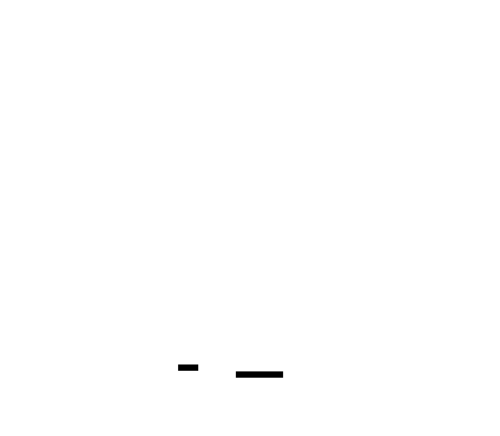

## Where the formalization stands

The Lean development closes every statement of the paper with **zero `sorry`** -- the headline
theorems (1.1, 1.2), the propositions (2.1, 2.2, 3.1, 4.1, 4.2), and the mid-level lemmas all
compile. But *closing a statement* and *proving it from first principles* are different claims, and
this project is scrupulous about the difference.

The self-contained cores -- the derivative computations, the geometry, the Grönwall / Lyapunov /
pigeonhole leaves (L1--L11) -- carry a clean kernel proof. The *deep* content that Mathlib lacks was
stated as a layer of clearly **labeled axioms**; "proving the axiomatized parts for real" means
**building that missing mathematics in Lean** and discharging them, so a node's effective status
climbs `axiomatised → machine-checked` (a node inherits the minimum status over its dependency
closure).

That program is now well underway, and the biggest piece is done: **the entire infrastructure axiom
layer is discharged.** The optimal-transport / Wasserstein theory (M2) and the mean-field
continuity-equation flow (M3, the linchpin every downstream milestone waited on) are now *built* from
Mathlib's Picard-Lindelöf, Grönwall, and coupling machinery, and are machine-checked. As a result
**the headline theorems no longer rest on any infrastructure axiom** -- `#print axioms theorem_1_1`
lists only a handful of *paper-level* dynamical statements (`cluster_to_point`,
`exists_disentangling_balls`, `exists_parked_schedule`; `theorem_1_2` adds `lemma_5_4`), each encoding
a specific result from the paper's Sections 2--5 that rests on classical theorems (LaSalle invariance,
Hartman-Grobman linearization) Mathlib does not yet have. This page is the public roadmap for that
program -- and, increasingly, a record of it.

## Progress so far

- **M2 -- Optimal transport / Wasserstein: [done]{.badge .ok} (machine-checked).** `Axioms.W2` is no
  longer opaque: it is now the *definition* `(Foundations.W2 μ ν).toReal` over the ENNReal Kantorovich
  coupling cost, and its five structural facts -- nonnegativity, symmetry, the triangle inequality, the
  map / `L²` displacement bound, and convexity along mixtures -- are proved theorems. Because `toReal`
  sends `⊤` to `0`, the honest ℝ-valued statements carry exactly the finiteness / measurability
  hypotheses that keep the ENNReal→ℝ bridge sound, discharged at the call sites from bounded (sphere)
  support.
- **M3 -- Mean-field flow, the linchpin: [done]{.badge .ok} (machine-checked).** The per-block
  characteristic flow `flowMap` is built as the fold of Picard-Lindelöf solutions of a `Block` -- a
  globally-Lipschitz, globally-bounded, radially-tangent velocity field with a duration. Its Lipschitz,
  bijectivity, semigroup (`comp` / `id` / reverse-and-negate `inv`), sphere-invariance, and parked laws
  are all *derived* from Mathlib's `IsPicardLindelof.of_time_independent` + Grönwall, with the sphere
  kept invariant by the radial-tangency identity. Every downstream milestone waited on this flow; with
  it and M2 discharged, the whole infrastructure axiom layer is now empty.
- **M4 -- Per-point transport (Appendix B): [in progress]{.badge .partial}.** The dynamical core of the
  mass-transport lemmas is machine-checked: the ReLU-gated cutoff velocity field of B.5 as a genuine
  well-posed `Block` (the quadratic tangential projector made globally Lipschitz by a bespoke
  *vanishing-gluing* argument -- a compactly-supported scalar times a locally-bounded-Lipschitz field is
  global), the finite-time logistic reaching estimate (B.7, via a log-odds substitution whose flow
  derivative is exactly `2g`), the cap contraction of the gated flow toward its centre, and the
  pushforward mass-retention bridge (B.8). Lemma B.1 is a proved induction over the single-ball lemma;
  Lemma B.2 is faithfully restricted to genuine geodesic balls (a soundness fix over arbitrary sets)
  with its full discharge dependency tree machine-checked. What remains is the general-position gate
  confinement and the final measure-preimage assembly.
- **M8a -- Atomless splitting: [done]{.badge .ok} (machine-checked).** `exists_atomless_partition` (the
  disjoint, prescribed-mass decomposition behind Proposition 2.2) is fully de-axiomatized. The
  measure-theoretic primitive it rested on -- **Sierpiński's intermediate-value theorem** for nonatomic
  measures -- is now a kernel-checked theorem: proved on `ℝ` (the cumulative `t ↦ μ(E ∩ (-∞,t])` is
  continuous because its increment is the Bochner primitive `∫ 𝟙_E`, valid *because* `μ` has no atoms,
  then the intermediate value theorem), and lifted to any standard Borel space by pushing the measure
  forward along a measurable embedding into `ℝ`. `#print axioms` on `exists_atomless_partition` and the
  IVT lists only `propext` / `Classical.choice` / `Quot.sound` -- no custom axioms, no `sorry`. A
  soundness bug was surfaced and fixed along the way (see below).
- **M5 -- Geodesic convexity on the sphere: [in progress]{.badge .partial}.** The geometric foundation
  is machine-checked: a `GeodesicConvex` predicate (closure under normalized great-circle chords), the
  fact that an **open hemisphere is geodesically convex** (the confinement the paper uses), and the full
  hull characterization -- `geodesicHull = cone ∩ sphere` *is* geodesically convex and *is* the smallest
  geodesic-convex set containing its generators. What remains for M5 is the Section 3.3 disentanglement
  geometry that consumes these facts; the paper axiom `exists_disentangling_balls` -- now that the flow
  layer (M3) is discharged -- waits only on that geometry, so it stays `axiomatised` for now.

Everything above is kernel-clean; the [claim graph](claimgraph.qmd) badges each node live, and the
commit history records every step under the [Conventional Knowledge Commits](history.qmd) discipline
(each `Status:` footer cross-checked against `#print axioms` by a pre-commit hook).

The leaves are written Mathlib-style from the start (snake_case terms, `UpperCamelCase` types,
everything namespaced under `MeasureToMeasure.*`), so the clean ones are born re-usable. The status
the badges read is *regenerated* from `#print axioms` and compared, which is the real drift guard: a
blueprint `checkdecls` only confirms each `\lean{}` name exists, not that its stated status still
matches the kernel. The full re-usability discipline is catalogued in the `lean-math` plugin's
[`reusable-blueprints.md`](https://github.com/aquemy/agent-plugins/blob/main/plugins/lean-math/skills/mathlib-ready/references/reusable-blueprints.md).

## The build DAG

The axioms do not fall independently -- they discharge in a definite dependency order. Eight
milestones (M1--M8), one linchpin, and one standalone first target:

.)](diagrams/build-dag.ink.svg){width=100%}

::: {.callout-note collapse="true"}
## The same graph, precise (D2 source)

The sketch above simplifies a few transitive edges for legibility. The declarative
[D2](https://d2lang.com) source (`site/diagrams/build-dag.d2`) is the exact, maintainable version,
carrying the full edge set (e.g. the direct `M1 → M7`, `M2 → M7`, and `M5 → M8b` dependencies):

{width=100%}
:::

## What must be built, and what Mathlib already gives

A three-part audit -- the pinned Mathlib, the wider Lean 4 ecosystem, and cross-assistant (the
Isabelle/HOL AFP and Coq/Rocq) -- mapped the boundary precisely. The gaps are exclusively the
optimal-transport and mean-field *layers*; the measure-theoretic substrate beneath them is mature.

| Layer | In the pinned Mathlib | Plan |
| --- | --- | --- |
| Nonatomic prescribed-mass splitting (Sierpiński) | absent (only an interval-*average* IVT) | **[done]{.badge .ok}** -- built on `NoAtoms` + IVT (M8a) |
| Mean-field / continuity-equation flow | absent (`Kernel`, `Measure.map` exist) | **[done]{.badge .ok}** -- the linchpin, built on `IsPicardLindelof` + Grönwall (M3) |
| Optimal transport / Wasserstein / Kantorovich | absent | **[done]{.badge .ok}** -- coupling-based `W₂` over the ENNReal cost (M2) |
| Geodesic convexity on the sphere | absent (`Sphere`, Riemannian metric exist) | **[in progress]{.badge .partial}** -- foundation + hull characterization built (M5) |
| ReLU-gated cap transport (Appendix B) | absent | **[in progress]{.badge .partial}** -- gated `Block` + reaching + mass bridge built (M4) |
| LaSalle / Lyapunov stability | theorems absent (`Flow`, `omegaLimit`, `IsPicardLindelof` exist) | **build** on the flow substrate |
| Measurable selection (Kuratowski--Ryll-Nardzewski) | absent | **build** on the Polish / analytic-set layer |

## What we can reuse

Nothing is importable across proof assistants, but the external audit found real leverage:

- **LaSalle / Lyapunov (M6)** -- a complete Coq proof (Cohen--Rouhling, ITP 2017,
  [`drouhling/LaSalle`](https://github.com/drouhling/LaSalle)) is a proof-structure blueprint, and
  [`mcdoll/DynamicalSystems`](https://github.com/mcdoll/DynamicalSystems) (Apache-2.0) ships Lean
  `LaSalle.lean` / `Lyapunov.lean` plus Carathéodory ODE extensions to vendor.
- **Optimal transport (M2)** -- absent in *every* assistant, so built genuinely from scratch
  ([done]{.badge .ok}): a coupling-based $W_2$ over the ENNReal Kantorovich cost, from which the bound
  the paper needs is a one-liner (the pair map is an admissible coupling; Santambrogio, *Optimal
  Transport for Applied Mathematicians*, Ch. 5).
- **Sierpiński splitting (M8a)** -- absent everywhere; **built** ([done]{.badge .ok}) via the
  cumulative-distribution + intermediate-value-theorem route rather than Fremlin's exhaustion argument,
  which turned out cleaner in Mathlib.
- **Geodesic convexity (M5)** -- Mathlib's Riemannian-geometry substrate is landing in open PRs, but
  geodesic convexity on the sphere is absent; **built in-repo** the elementary way (normalized
  great-circle chords, pure inner products), the foundation now machine-checked
  ([in progress]{.badge .partial}).

A caveat kept in mind: several "0 `sorry`" AI-generated Lean repos for LaSalle/Lyapunov exist, but
such artifacts frequently prove weakened statements -- so any reuse is gated on a `#print axioms`
check and a statement-faithfulness review, the same discipline this project applies to its own claims.

## What we could give back: ForMathlib candidates

The reuse audit runs both ways. Several of the machine-checked leaves are general-purpose spherical
geometry with no dependence on the paper's specific construction, so they are natural **ForMathlib
candidates** (marked in the Lean source with a `-- ForMathlib candidate:` comment):

- the **tangential-projector identities** `P_x^⊥ v = v - ⟪x,v⟫ x` (symmetry, idempotence, and the
  quadratic identity `⟪P_x^⊥ v, v⟫ = ‖v‖² - ⟪x,v⟫²`);
- **geodesic distance** `d_g(x,y) = arccos⟪x,y⟫` with its range and `cos`-of-angle facts;
- the **separating-hyperplane** bound from cosine monotonicity;
- **barycenter non-colinearity** for disjoint geodesic hulls.

These are *prepared*, not published: staging them ForMathlib-style (minimal imports, generic names,
an Apache header, passing linters) is a mechanical readiness step, but actually contributing them to
Mathlib is a deliberate human decision, not something the pipeline does on its own. The optimal-transport
and mean-field-flow layers (now built in-repo, M2 / M3) are broader developments whose upstreaming
would be a much larger, separate effort than these self-contained geometry leaves.

## The first target: M8a -- discharged

The chosen first slice was the smallest self-contained win: discharge `exists_atomless_partition` (the
disjoint, prescribed-mass decomposition behind Proposition 2.2) by building the nonatomic splitting
theorem. It needs no optimal-transport or flow prerequisites, which is why it started the program --
and it is now **complete and machine-checked** (see *Progress so far* above). The pieces are normalized
restrictions `(αₖ)⁻¹ • μ|_{Aₖ}` to a disjoint partition carved by iterating the Sierpiński IVT; that
IVT, absent from Mathlib, was built from scratch on `NoAtoms` + the intermediate value theorem.

::: {.callout-warning}
## A soundness bug, surfaced while planning -- and fixed

The axiom as originally stated was **inconsistent**. It demanded a decomposition whose every piece sits
in an open hemisphere -- but at $M = 1$ that forces the *whole* measure into a half-space, which no
centrally-symmetric atomless measure (a Gaussian; the uniform law on a ball or sphere) satisfies. The
fix drops the hemisphere clause from the *partition* and acquires it dynamically per piece, the way
the paper actually does. A second soundness point: the splitting is only true on a **standard Borel
space**, not for bare `NoAtoms` (a countable--cocountable `0/1` measure is a counterexample) -- so the
proved theorem carries that hypothesis, which `Eucl d` satisfies. These are the latest of several
fidelity corrections the formalization has forced -- the entire point of running the argument through a
kernel.
:::

## Scale and honesty

One honesty subtlety the per-node badges cannot see: a hand-written axiom *layer* must also be
**jointly consistent**. A per-node `#print axioms` check is blind to a contradiction spread across
several axioms -- an inconsistent block would let the kernel prove anything while every badge still
reads clean. The M8a soundness bug (the `M = 1` hemisphere collapse, above) was exactly such a latent
inconsistency, caught by reasoning about a model rather than by any single `#print axioms`. So each
axiom carries the obligation to exhibit -- or, once discharged, to *derive* -- a model that satisfies
it; discharging the layer is what replaces that argument with a machine-checked one.

The [claim graph](claimgraph.qmd) shows the live per-node status; the
[repository](https://github.com/aquemy/measure-to-measure-transformers) holds the complete roadmap
(milestone dependencies, effort tiers, reuse targets, and the execution-ready M8a plan).
